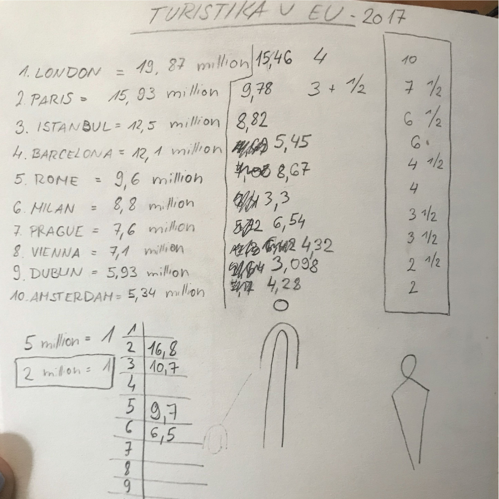

# Case study- Infographic poster

As a graphic design student, I was given a task to choose any statistical data and project them into an eye-catching poster for my typography class. 

First I had to find some interesting data which was the main problem. I started brainstorming and mainly researching various statistical websites. I wanted something that would interest a broader audience and I would be able to creatively portray it on the poster. I found out that it is not that easy to find some usable data. I needed some data that would be easy to understand without any text and at the same time interesting enough for the reader to actually view it. 

The first data that I came up with was about wind power turbines. The whole name of the data pack was "Number of wind turbines in the 10 largest EU countries in 2017" but when I tried to make some sense out of all the data it was very unclear I was not sure how would I portray it for the people to understand. 

After this first unsuccessful attempt, I found some data about graduates at Czech universities. Specifically, it was the number of graduates from state universities and the number of graduates from private universities and the difference between them in the years of 2010 and 2018. It was quite good data but I still could not imagine how I would design my poster with this data.

`Fisrt data sketch.`

Finally, I found data that was clear, interesting, and easy to design. So I decided I would make my poster about Tourism in EU cities in the years 2012 and 2018.

`Second data sketch.`

When I decided on the topic I needed to think about the design for a while. I did some research and found some inspiring infographic posters. 

`Inspiration-found on the internet.`

After I got inspired a little bit I had some vision of how my poster would look like. I knew I wanted to do a simple infographic poster with some icons that would portray tourists. I did some sketches of my tourists and then I designed them in Adobe Illustrator. 

`Sketch of tourists.`

The final poster is, in my opinion, very easy to read and it is eye-catching. I found the data very interesting.

`Final poster.`
