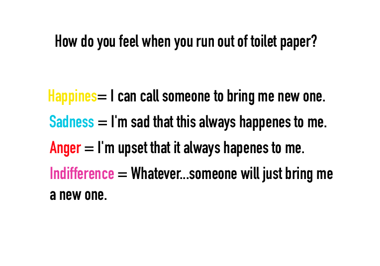
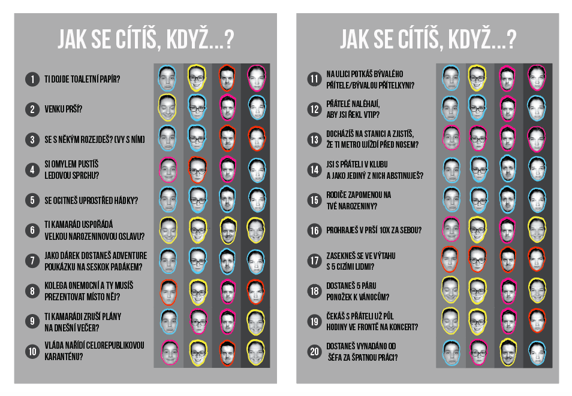

# Presentation ? 

Hello,my name is Kateřina Hrubá and I am a graphic design student.  

When we were given the assignment to do a presentation for our english class and I had to really think about what I want to do. First I was thinking that I would do just a summary of this semester but then I remembered a project I did at the end of last school year with some of my classmates. 

## The Final Project - Klauzury 
So to show you the whole picture first I should tell you that at the end of the second semester every year we have one final project that our grade depends on. Last year the topic of this final project was infographics. This was a topic that was given to us by Martin Strnad who works in an HMS graphic design studio. He was also our consultant for this project. 

`Martin Strnad.`

`Work of HMS-design studio.`

So right after we received the assignment we got divided into groups of four or five people. I was in a group with people that I knew from my classes. We all started brainstorming how to conceive this project. It was already during the pandemic so we had to figure it all out using zoom or other online communication channels. Sometimes it was pretty hectic.
We wanted to create something that would be interesting for our poster but also for us to work on. Our group consisted of four people. Three girls and one boy and maybe even because of that our topic for the project was more emotional and psychological. 

## The Theme
Our first thought was to track our changing moods for about a week and then analyze the effect of a different part of the day on our emotions. We were thinking that we could read from the result for example if females respond to a different part of the day differently than males or who is a morning person and who is not. We consulted this idea with Martin Strnad and he pointed out that the data we would get could be very misleading. And he suggested to maybe concentrate more on our characters than our emotions. 

So we came up with an idea to do a test of temperament. We first searched for some information about the four fundamental personality types. There is choleric, melancholic, phlegmatic, and sanguine. And each one of them has a set of characteristics that describes it. We then needed to thought about how are we going to work with those characteristics.

## The Survey
We came up with an idea to do a survey that would define each type of personality. We all knew that surveys of this type can be pretty boring so we came up with some original and funny questions. Each question had four answers that you could choose from and every answer was linked to a different personality type. The four answers were emotions you feel when something happens to you. There were happiness, sadness, anger, and indifference. We also wanted the final poster to be personal so instead of doing a quantity survey we did a quality one and only the four of us from the group completed the survey. After we completed it we were able to match each one of us to a certain personality type. 

`One of the questions from the survey.`

## The Design
After we had all our data the main problem was how we wanted it to illustrate it on our final poster. We thought that we would do a graph with all our answers.

`inspiration #1 from pinterest.`

`inspiration #2 from pinterest.`

`inspiration #3 from pinterest.`

But in the end, we did a poster and a table of our responses. In the table we put the questions and we used our headshots of different emotions as answers.

`Our final table.`

The poster was based on the percentage evaluation of 4 basic answers to the questions in the survey and the overall temperament we got from the survey. We decided to use only our headshots for the poster because we feel most of our emotions are formed in our heads. Then we divided the headshots according to the percentage of our answers.

`#1 sketch.`

`Our final poster.`

## The Presentation
Ultimately we gave a presentation of our final poster and we were met with positive reactions. They all liked our idea to cut the heads and also they thought it was a really interesting topic. We, as a group, were able to overcome the disappointment of rejecting the first idea and come up with something even better. We had really fun as a group doing this project and I think it was projected in our final work.

`Our team (from left: Kateřina, Jana, Lída, Matěj).`

So I think I eventually choose the right topic for my english class presentation andI enjoyed the trip to my past.

Thank you for your attention.

Here you can find pdf version of my presentation: [CV-hruba.](https://github.com/hruba/english-for-designers/blob/main/05-presentation-storytelling/Presentation.pdf)

