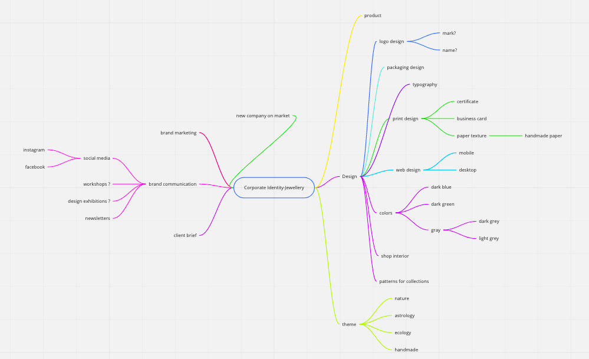

# Corporate Identity For a New Jewelry Brand

My thesis is about the corporate identity of a newly created jewelry brand. It describes the way how to design a visual identity and establish a new brand on the market.

  
Mind Map

  

## Voice & Tone

- **Voice:** Human, confident, educated, and inspirational.
- **Tone:** Formal (academic), but friendly, enthusiastic, and conversational.

## Outline

1. Key point; aim for a single-sentence in 120 characters or less.
2. Key point; aim for a single-sentence in 120 characters or less.
3. Key point; aim for a single-sentence in 120 characters or less.
4. Key point; aim for a single-sentence in 120 characters or less.
5. Key point; aim for a single-sentence in 120 characters or less.
6. Another key point?
7. Too long, didn’t read?

### Notes

- …
- …
- …

## Keywords

- **Keyword**
  - Definition/description; aim for a single-sentence in 120 characters or less.
- **Keyword**
  - Definition/description; aim for a single-sentence in 120 characters or less.
- **Keyword**
  - Definition/description; aim for a single-sentence in 120 characters or less.
- **Keyword**
  - Definition/description; aim for a single-sentence in 120 characters or less.
- **Keyword**
  - Definition/description; aim for a single-sentence in 120 characters or less.

### References

- [APA Style Reference Examples](https://apastyle.apa.org/style-grammar-guidelines/references/examples)
- [Reference](http://)
- [Reference](http://)
