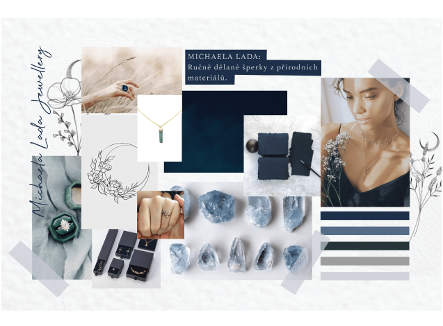
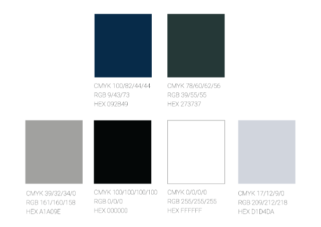
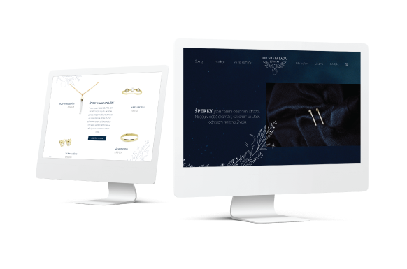

<!-- Add an *optional* hero image to provide visual context. -->

# The Story Of My Bachelor Thesis

By: Kateřina Hrubá

Date: 30.3.2021

## Abstract

The topic of my bachelor's thesis is the brand identity of a newly created brand on the market based on real collaboration with the client. It is a very small startup Czech brand of luxurious gold jewelry called Michael Lada Jewelry started by a young goldsmith Michaela Antalová. The jewelry is handmade and can be worn on regular basis as well as on special occasions.

In the theoretical part, I describe and define the basic concepts that are related to brand identity and how important they are in the creation of corporate identity. At the same time, I define the jewelry market in the Czech Republic and I did a detailed analysis of Czech and foreign jewelry brands with similar merchandise.

In the practical part, I used the knowledge from the theoretical part and I describe in detail the creation of brand identity and design system for a specific brand Michael Lada Jewelry. I focused on logo design, design of printed materials, and web and social media design. Part of the practical part is a description of collaboration with the client.

The aim of my bachelor's thesis is to create a functional brand identity for a newly created jewelry brand on the Czech market so that it can be used in the future and increases awareness of the brand and the production of jewelry as such.

Keywords:
Brand identity, visual identity, unified visual style, Jewelry brand, startup, logo design, webside design, printed material design

## Article

Hello,
My name is Kateřina Hrubá and the topic of my bachelor’s thesis is the corporate identity of a newly created jewelry brand and its impact on establishing a new brand on the market.

It all started in June 2020 when I had to start thinking about my bachelor thesis. At the same time my good friend from high school, Michaela, got her goldsmith certificate and wanted to start a new brand of luxury golden jewelry. She reached out to me with an offer of collaboration on her logo and the whole brand identity and I thought that it could be the perfect topic for my bachelor thesis.

`Me and my friend in High School (From left: Michaela, me).`

So during the summer, we met a few times and we started to work on the brand. We did a lot of brainstorming and creative briefs. After we figured out the main values and communication we started to think about the logo and we created a mood board for the whole brand. 

`Moodboard for Michaela Lada Jewelry.`

My friend is a very creative person herself and she had some requirements regarding the logo design. She knew she wanted it to reflect her jewelry and wanted to combine the two main topics which are nature and the universe. So as I was working on some first logo sketches I really had to think about that. One of the things that I had to work with was the name of the brand. There were no doubts. That the brand will be named after my friend Michaela and she also wanted to use her middle name. So the first suggestion for the brand name was Lada Michaela Jewelry. But then we changed it to Michaela Lada Jewelry because her true name is Michaela Lada.

When we did the mood board we already had the main colors figured out. My friend was sure she wanted dark blue as the universe and dark green as nature and I thought that the dark color scheme could be something that would differentiate us from other jewelry brands.

`The color scheme for MIchaela Lada Jewelry.`

So to get back to the logo design. The logo design itself was tricky but also very fun and creative. I came up with some first ideas and my friend always gave me feedback.

`The first sketches of the logo.`

We went through a lot of different types of logos. I wanted it to be a gentle feminine logo that would represent the jewelry, values, and my friend also. In the end, it was down to two logos. These two logos were our favorites and so we took some time to think about them. I even printed them out and put them on my cardboard so I could look at them from a different perspective. In the end, we chose the final logo mostly based on how we felt about it. I also did a typography logo for simple use. 

`The final logo.`

After I designed the logo we agreed that the logo should not be the main and only element of the whole visual identity. So I came up with illustrations that would help set up the mood of the brand. 

I did one main illustration that can be used anywhere and the I did illustrations for four collections of jewelry that my friend had in mind. I could always do other illustrations for a different collection that would my friend do in the future. 

The min illustration combined the symbols of the two main topics for Michaela Lada Jewelry, nature and the universe. This illustration can be used instead of the logo with just the typography logo.

`The main iluustration.`

For the collections, I did four pattern illustrations each representing the main theme of each collection. The names of the collections are Nature, Astral, Connection, and Forest. These patterns can be used on the packaging as well as on the website or social media.

`The four patterns for collections.`

Because my friend wanted to make clear to her clients that her jewelry combines nature and the universe not just through the theme but also with the usage of materials. She uses mainly gold and crystals. Gold is material from mother nature and crystals came to earth from the universe. We came up with a simple slogan,, In connection…“ It represents everything that Michaela Lada Jewelry stands for. The jewelry can connect the person wearing it to the universe or to nature or even with her wedding collection that is called connection, connects two people together. 

The slogan is changing according to use. Sometimes it's connected to the collection for example: ,, In connection…with the universe“ and sometimes it just represents the values of the brand,, In connection…with yourself“.

`Posters with slogan.`

When I finished the logo and we came up with the slogan I did some more design work.

I designed all the printed materials that my friend would need as a jewelry maker and seller. For example business card, certificate of authenticity, or a personal note that would give away with her jewelry. I chose to design these on handmade paper because for Michaela the handmade work is very important as all of her jewelry is purely handmade.

`The printed materials for Michaela Lada jewelry.`

Then I focused on the website, newsletters, and Instagram feed because these are the most important communication channels she will be using. All these things respected the whole design systém. When I designed the Instagram feed the main focus was on the communication language. I wanted it to feel personal, inspirational, and creative but at the same time, I needed it to be comprehensive and clear. We also wanted to show the customer the process behind the creation of golden jewelry.

`The design of wesbite.`

Last but not least I designed the packaging for the jewelry. For the small boxes for the jewelry, I used simple grey boxes that would come across as elegant but also not too much. On top of these boxes, I put the logo.

`The small box.`

I also did bigger boxes that would hold the small box and all the printed materiál that would go with the order. These boxes used the illustration according to the collection. They are simple and elegant and also respect the design systém.

`The bigger boxes.`

I had a bit of a problém with the shopping bags because I wanted them to be elegant and luxurious but at the same time very simple so that they would not steal all the attention. In the end, I chose simple small bags with ribbons and I put the main illustration on top of it with the slogan and typography logo. So if you look at the bag you might as well read it as,, In connection… (with) Michaela Lada jewelry“ which is true because every customer should feel connected to the jewelry and the brand itself.

`The shopping bags.`

Overall I really enjoyed working on my bachelor thesis and I would consider it successful. The collaboration with an actual and very creative client enriched me a lot and I am proud of this project.

Thank you for your attention and have a great day.

Here you can see my video presentation: 

# Case Study

<video controls src="Aj" width="100%">

  

